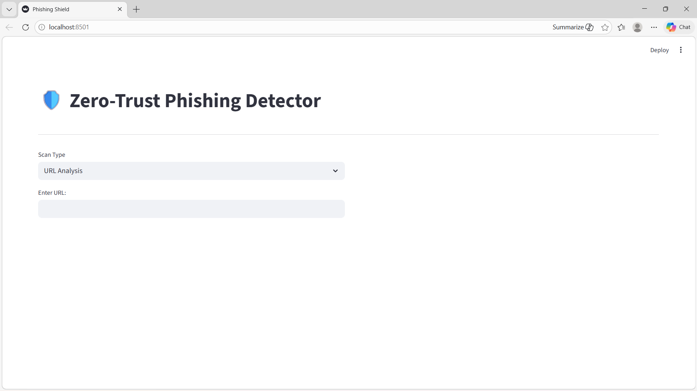

# 🔐 Phishing Website & Email Detection System

A Machine Learning–based web application that detects whether a **Website URL or Email message** is Phishing or Legitimate.

The system uses NLP techniques and Deep Learning models to analyze URLs and email content, providing real-time predictions through an interactive Streamlit dashboard.

---

## 🚀 Features

- 🌐 Phishing Website URL Detection
- 📧 Phishing Email Content Detection
- 🤖 Deep Learning models using TensorFlow / Keras
- 🧠 NLP-based text preprocessing
- ⚡ Real-time prediction results
- 📊 Interactive dashboard built with Streamlit
- 🖥️ Clean and user-friendly interface

---

## 🛠️ Tech Stack

- Python
- TensorFlow / Keras
- Scikit-learn
- Pandas
- NumPy
- NLP (Text preprocessing / Tokenization)
- Streamlit
- VS Code

---

## 📂 Project Structure

```

phishing_detection_project/
│
├── app.py
├── website_model/
├── email_model/
├── assets/
│   └── homepage.png
├── requirements.txt
└── README.md

```

---

## 🧠 How It Works

### 🔎 Website Detection
- Extracts URL-based features
- Applies preprocessing
- Uses trained ML/DL model
- Predicts: Phishing or Legitimate

### 📧 Email Detection
- Cleans and tokenizes email text
- Converts text into numerical sequences
- Uses deep learning model for classification
- Outputs prediction with probability score

---

## ▶️ How to Run the Project

### 1️⃣ Clone the repository

```

git clone [https://github.com/Nagavalli14/Phishing-URL-and-EMAIL-Detection]
```

### 2️⃣ Navigate into the folder

```

cd phishing_detection_project

```

### 3️⃣ Create virtual environment

```

python -m venv venv

```

### 4️⃣ Activate environment

**Windows:**
```

venv\Scripts\activate

```

**Mac/Linux:**
```

source venv/bin/activate

```

### 5️⃣ Install dependencies

```

pip install -r requirements.txt

```

### 6️⃣ Run the application

```

streamlit run app.py

```

Open in browser:

```

[http://localhost:8501](http://localhost:8501)

```

---

## 📸 Screenshots



---

## 🎯 Future Enhancements

- Deploy on Streamlit Cloud
- Add real-time URL scraping
- Integrate spam dataset expansion
- Improve model accuracy with advanced NLP techniques
- Add database logging for predictions

---

## 👩‍💻 Author

B SriVidya Nagavalli
B.Tech Computer Science  
Machine Learning & AI Enthusiast  

---

⭐ If you found this project useful, consider giving it a star!
